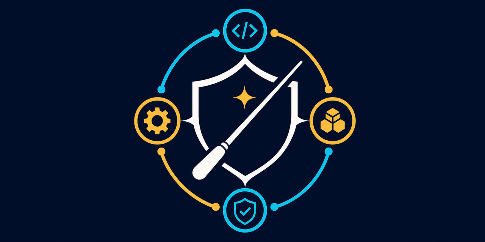

---

# Agent Guild Orchestra

Codexを、成果品質、安全な権限境界、検証可能性を優先して動かすためのGuild runtimeテンプレートです。実作業のリポジトリとオーケストレーション用の契約・状態を分離し、作業の大きさとリスクに応じた委譲、検証、監査を支援します。

現在のバージョンは`1.1.0`です。

> [!IMPORTANT]
> このプロジェクトは独立したコミュニティプロジェクトであり、OpenAIによる公式提供、提携、支援、承認を受けたものではありません。Codex、GPTおよびOpenAIはOpenAIの商標または登録商標です。本プロジェクトはOpenAIのロゴを使用しません。

## まず知っておくこと

導入先は、実作業リポジトリそのものではなく、それらをまとめる専用のGuild rootです。

```text
<guild-root>/
├── AGENTS.md
├── .agents/
├── .codex/
├── .orchestra/
└── repositories/
    ├── app-a/
    └── app-b/
```

各作業の対象となる`target_repo_root`は、`repositories/`直下にある個別リポジトリのGit rootへ固定します。インストーラーは`repositories/`配下の実作業リポジトリを移動・削除しません。

## 前提条件

- Git
- Docker EngineまたはDocker Desktop（`docker build`と`docker run`を実行できること）
- Codexのproject-local設定とcustom agentを利用できる環境
- Docker imageの初回build時に、base imageとPython依存関係を取得できるネットワーク

ホストへPythonパッケージを直接インストールする必要はありません。検証と導入スクリプトはDocker内のPythonで実行されます。

## 初回導入

### 1. cloneして配布物を検証する

```bash
git clone https://github.com/nir-nmttg/agent-guild-orchestra.git
cd agent-guild-orchestra
make validate
```

`make validate`は、安全境界、role・model設定、queue・snapshot契約、最終成果のhard gate、日本語化方針など、リポジトリが提供する一連のvalidatorを実行します。

### 2. 実際の導入先に対してdry-runする

```bash
./scripts/install.sh \
  --target /path/to/guild-root \
  --mode copy \
  --dry-run
```

出力された作成・更新対象を確認してください。導入先には、子リポジトリや`repositories/`自体ではなく、その親となるGuild rootを指定します。

### 3. バックアップ付きで導入する

```bash
./scripts/install.sh \
  --target /path/to/guild-root \
  --mode copy \
  --backup
```

既存の管理対象がある場合、変更前の状態は`<guild-root>/.agent-guild-orchestra-backups/<timestamp>/`へコピーされます。新規の空ディレクトリへ導入する場合は、バックアップ対象がないためbackupは作成されません。

導入後、実作業リポジトリを`<guild-root>/repositories/<repo>`へ配置します。

## 通常の更新

配布元リポジトリを更新し、`sync.sh`で既存環境へ反映します。`sync.sh`は更新前のバックアップを自動で有効にします。

```bash
cd /path/to/agent-guild-orchestra
git pull --ff-only
make validate
./scripts/sync.sh --target /path/to/guild-root --dry-run
./scripts/sync.sh --target /path/to/guild-root
```

通常更新では、既存の`.orchestra/queue/`、Ledger、dashboardを保持しながら静的な配布物を更新します。互換性のない古いruntime schemaが見つかった場合、インストーラーはfail closedで停止し、状態の初期化方法を案内します。

## 安全なクリーンインストール

管理対象を配布物の現在状態から作り直す必要がある場合だけ、`clean_install.sh`を使います。これはアンインストーラーではなく、動的状態を含む管理対象を初期化して再導入するコマンドです。必ずdry-runの確認後に、`--backup`付きで実行してください。

```bash
./scripts/clean_install.sh \
  --target /path/to/guild-root \
  --backup \
  --dry-run

./scripts/clean_install.sh \
  --target /path/to/guild-root \
  --backup
```

バックアップは削除・初期化より先に作成されます。クリーンインストールによる扱いは次のとおりです。

| 対象 | 扱い |
| --- | --- |
| `.agents/orchestra/` | 削除後、現在のtemplateから再作成 |
| `.agents/skills/` | 本プロジェクトがownerのskillだけを削除後、再作成。他ownerのskillは保持 |
| `.codex/` | ディレクトリ全体を削除後、再作成。独自設定がある場合はbackupから必要部分を選んで復元 |
| `.orchestra/` | 削除後、queue・Ledger・dashboardを初期状態で再作成 |
| `AGENTS.md` | 本プロジェクトの管理ブロックだけを除去後、再作成。ブロック外は保持 |
| `.git/info/exclude` | 本プロジェクトの管理ブロックだけを除去後、再作成。ブロック外は保持 |
| `repositories/`とその配下 | 保持。移動・削除・backupの対象外 |

`.orchestra/`の監査履歴が必要な場合や`.codex/`に独自設定がある場合は、実行前にbackupの保存先と復元方針を確認してください。

## 変更される範囲とバックアップ

通常の導入・更新では、指定したGuild rootの次の範囲を作成または更新します。

- `AGENTS.md`内の`agent-guild-orchestra`管理ブロック
- `.agents/orchestra/`と、ownerが本プロジェクトである`.agents/skills/`
- `.codex/`
- `.orchestra/`（queue、Ledger、dashboardなどの動的状態）
- `repositories/`ディレクトリ
- Gitリポジトリの場合は`.git/info/exclude`内の管理ブロック（`--no-git-exclude`で省略可能）

`--backup`は、既存の`AGENTS.md`、`.git/info/exclude`、`.agents/`、`.codex/`、`.orchestra/`をtimestamp付きディレクトリへコピーします。`repositories/`配下は含みません。

## 復元とアンインストール

自動復元・アンインストールコマンドは現在ありません。復元が必要な場合は、Codexや関連プロセスを停止し、現在の状態も別途保全してから、`.agent-guild-orchestra-backups/<timestamp>/`に保存された各パスを元のGuild rootへ戻してください。backupに存在しない新規作成物は自動では削除されません。

手動で管理対象を除去する場合も、`repositories/`配下には触れないでください。`AGENTS.md`と`.git/info/exclude`ではファイル全体ではなく、本プロジェクトの開始・終了markerで囲まれた管理ブロックだけを除去します。

## クイック検証

配布元リポジトリの変更後や導入前は、まず次を実行します。

```bash
make validate
make install-dry-run
```

`make install-dry-run`は一時ディレクトリを使って、変更を書き込まずに初回導入経路を確認します。実際のGuild rootに対する変更予定は、`install.sh`、`sync.sh`、`clean_install.sh`の各`--dry-run`で確認してください。

## 運用上の保護

- CIは最小権限の`contents: read`でvalidatorと変更範囲のwhitespace検査を実行します。
- [CODEOWNERS](.github/CODEOWNERS)は全pathを`@nir-nmttg`のownership対象とし、CODEOWNERS自身も明示的に同じownerへ割り当てます。
- CODEOWNERSファイルだけではmergeを強制できません。GitHub側で`main`のbranch protectionまたはrulesetを設定し、CI成功、CODEOWNER review、Pull Request経由の変更を必須にしてください。
- `main`へ直接pushせず、通常のmergeではPull Request作成者とは別の、writeまたはadmin権限を持つCODEOWNERが承認する運用にします。
- 脆弱性の可能性がある情報は公開Issueへ投稿せず、[セキュリティポリシー](SECURITY.md)の非公開報告手順を利用してください。

現在のCODEOWNERは`@nir-nmttg`一名だけです。GitHubではPull Request作成者は自己承認できないため、本人のPull Requestにもreviewを必須とし、bypassを許可しないstrict運用には、別のwriteまたはadmin権限を持つCODEOWNERの追加が必要です。

単独maintainerで、repository recoveryや緊急のsecurity対応に備えてowner・adminのbypassを残す場合も、通常のmergeには使いません。やむを得ず使った場合は、理由、検証結果、残リスクをPull Requestまたは追跡可能な記録へ残してください。詳細は[コントリビューションガイド](CONTRIBUTING.md)を参照してください。

GitHub側のbranch protection、ruleset、Private vulnerability reportingなどは、リポジトリ内のファイルを追加しただけでは有効になりません。公開・運用開始時に設定を確認してください。

## セキュリティ

secret、token、credential、password、key、認証情報、PIIは読まず、書かず、要約しません。破壊的操作、依存追加、migration、deploy、本番影響、認可、公開API互換性変更、外部network有効化には人間の確認を要求します。

脆弱性の可能性がある情報を公開Issueへ投稿しないでください。報告方法と対応バージョンは[セキュリティポリシー](SECURITY.md)を参照してください。

## 仕組み

- `Guild Law`: 対象リポジトリ、secret・PII、状態更新に関する安全境界
- task contract: objective、success criteria、scope、authority、validationの明確化
- `evidence_state`: blocker、失敗したcheck、scope drift、high-risk trigger、検証状況の追跡
- risk-based delegation / Trial: 独立して境界を切れる作業だけをagentへ委譲
- `Ledger`: 検証根拠と残リスクを記録するSQLite監査履歴
- helper-issued snapshotとqueue lineageのfail-closedな検証

数値confidence、固定回数のread・test、全案件共通の長いchecklistには依存しません。Rootはtop-level assignmentを直接作り、唯一のnested edgeとして`inquisitor`からterminal `examiner`への単一focus委譲だけを許可します。

利用例は[ユースケース集](docs/use-cases/README.md)、設計の詳細は[orchestration runtime](docs/orchestration-runtime.md)と[agent deployment](docs/agent-deployment.md)、モデル選択の方針は[モデル選択評価](docs/model-selection-evaluation.md)を参照してください。

## 対応範囲と既知の制約

- 導入modeは現在`copy`のみです。
- runtime schema v3を前提とします。古いschemaの状態は、そのまま保持更新できない場合があります。
- Docker imageはbuild時に外部registryとPython package indexへ接続します。オフライン環境では事前準備が必要です。
- Codexやモデルの提供状況、設定形式、利用条件の変更により、role設定の調整が必要になる場合があります。
- 本プロジェクトの安全境界は運用を支援する契約であり、OS、container、GitHubなどのアクセス制御を代替しません。
- `repositories/`配下のアプリケーション自体の品質、ライセンス、セキュリティは各リポジトリの管理者が確認してください。

## コントリビューションとサポート

IssueやPull Requestを送る前に[コントリビューションガイド](CONTRIBUTING.md)と[行動規範](CODE_OF_CONDUCT.md)を確認してください。利用方法の質問とサポート範囲は[サポート方針](SUPPORT.md)に記載しています。

直接依存関係のライセンスinventoryは[第三者ライセンスに関する通知](THIRD_PARTY_NOTICES.md)を参照してください。

## ライセンス

このプロジェクトは[MIT License](LICENSE)で提供されます。[日本語参考訳](LICENSE.ja.md)も用意していますが、法的効力を持つ条件は英語版の`LICENSE`が優先します。
