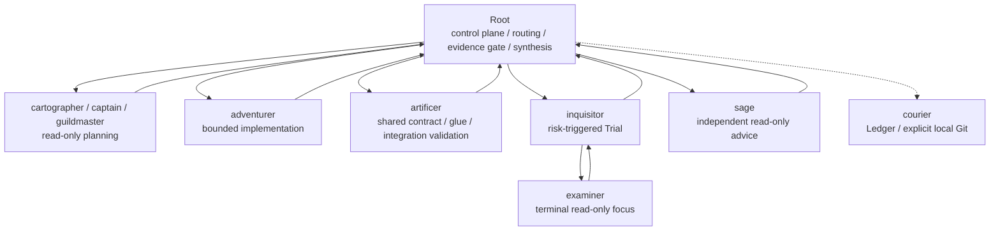

# Agent deployment

Codexはギルド規約rootで起動し、作業repoを `<guild_root>/repositories/<repo>` に置きます。Rootは`target_repo_root`を固定し、top-level custom agentを直接起動します。

## Configuration

Root modelはSolに固定しますが、project-local reasoning effortは指定しません。起動時/UI/global configなどで利用者が選ぶ`high`、`xhigh`、`ultra`をそのまま使います。どのmodeでもRootはcoordinationとjudgeに専念し、対象repoの作業をnamed roleへ委譲します。

```toml
model = "gpt-5.6-sol"
sandbox_mode = "read-only"
approval_policy = "on-request"

[sandbox_workspace_write]
network_access = true

[agents]
max_threads = 64
max_depth = 2
job_max_runtime_seconds = 2400
```

clean installと通常の再installはいずれもproject-local `model_reasoning_effort`を出力しません。導入先に旧指定があれば再install時に除去し、reasoning effortの選択はsession/global/user設定へ委ねます。installerやorchestrationはeffortを自動選択しません。`ultra`がproactiveに委譲する場合も、Root→named top-level roleと`inquisitor`→`examiner`以外の辺、depth、authorityを追加しません。

`job_max_runtime_seconds=2400`は、xhighのSage助言とTrial判断が中途で打ち切られないためのjob単位の有界timeoutです。並列数、総spawn数、token、costの上限は変更しません。

`workspace-write` agentの外部通信は有効です。外部通信を伴うコマンドも`approval_policy = "on-request"`と実行環境の承認境界に従います。

`inquisitor`だけが`features.multi_agent=true`で、risk-triggeredな単一focusを`examiner`へ委譲できます。その他のcustom agentは`features.multi_agent=false`のterminal workerです。`max_depth=2`と`max_threads=64`を設定し、policy上はRoot(depth 0)→Inquisitor(depth 1)→Examiner(depth 2)だけを許可します。role別`max_parallel`は`adventurer.max_parallel=32`、非adventurer合計16の計48とし、global 64との差16は特定roleの予約枠ではない未割当headroomとして残します。これらの値は同時実行の設定であり、総spawn数、token、costのhard capとは扱いません。

## Deployment role pairs

| agent | model | sandbox | reasoning | responsibility |
| --- | --- | --- | --- | --- |
| Root | `gpt-5.6-sol` | `read-only` | project-local未指定。利用者が`high / xhigh / ultra`を選択 | control-plane確認、routing、evidence gate、次action、最終統合 |
| `adventurer` | `gpt-5.6-terra` | `workspace-write` | `high` | 一つのbounded scopeの調査、実装、検証 |
| `artificer` | `gpt-5.6-sol` | `workspace-write` | `high` | 共有契約、cross-scope glue、統合検証 |
| `sage` | `gpt-5.6-luna` | `read-only` | `xhigh` | 具体的な独立focusの助言 |
| `cartographer` | `gpt-5.6-sol` | `read-only` | `high` | read-only mapmaking |
| `courier` | `gpt-5.3-codex-spark` | `workspace-write` | `xhigh` | Ledgerと明示されたlocal Git操作 |
| `examiner` | `gpt-5.6-terra` | `read-only` | `high` | 単一focusのbounded review evidence |
| `guildmaster` | `gpt-5.6-sol` | `read-only` | `xhigh` | 複数Partyの広域戦略 |
| `inquisitor` | `gpt-5.6-sol` | `read-only` | `xhigh` | Trial、finding統合、最終decision |
| `captain` | `gpt-5.6-sol` | `read-only` | `high` | scope、順序、integration、Trial設計 |
| `warden` | `gpt-5.6-sol` | `read-only` | `high` | 例外的な制御診断 |

deploymentは、decision authority、blast radius、scopeのboundedness、ownerによる再検証可能性から固定しています。高頻度で単一scopeを実装・検証する`adventurer`と、単一focusのevidenceだけを返す`examiner`はTerra/highです。狭いfocusでもarchitectureやsafetyの考慮漏れをownerが完全に再現できない`sage`はLuna/xhigh、Trialの最終採否と重大度統合を持つ`inquisitor`はSol/xhighとします。未知領域のomissionが下流へ波及する`cartographer`、scopeと共有契約を設計・統合する`captain` / `artificer`、例外時だけ難しい診断を行う`warden`はSol/highを維持し、最大blast radiusを持つ`guildmaster`はSol/xhighです。Courierは従来どおり5.3-Spark/xhighを維持します。

subagentのreasoning effortはroleごとに固定し、実行中に動的変更しません。deployment pairに対するstronger / alternative challengerはmodel-selection evalで比較できますが、実行中の自動切替には使いません。`max`と`ultra`は全subagentから除外します。Rootのcomponent referenceはhighですが、runtime templateへはpinせず、high/xhigh/ultraを利用者が選びます。

## Guild role naming

custom agentの機械IDは、責務を推測できる一語のGuild職へ統一します。

| retired ID | current ID | role boundary |
| --- | --- | --- |
| `party_leader` | `captain` | Partyのscope、順序、統合、Trial設計 |
| `integration_owner` | `artificer` | cross-scope契約、glue、統合検証 |
| `focus_reviewer` | `examiner` | Trialの単一focusに対する独立evidence |
| `advisor` | `sage` | owner判断を補う一論点のread-only助言 |
| `quest_sentinel` | `warden` | 通常制御で解消しない例外の診断 |

旧IDと新IDを同じruntimeで混在させません。通常installは旧agent fileを除去し、既存SQLite stateに旧worker ID、role、kindが残る場合はfail closedにします。必要なstateを保全したうえで`--backup --reset-runtime`または`--clean-install`を使ってください。

## Topology



Rootだけがtop-level agentを起動し、`captain`などはterminalです。唯一の例外として`inquisitor`が`examiner`を直接起動し、完了を待ってevidenceを検証・統合します。nested assignmentのscopeとauthorityは親より狭められますが、helper-issued subject snapshotは親Trialと完全一致させます。depth 2を超える再帰fan-outは禁止します。Rootはtarget、authority、snapshot、queueをcontrol-planeとして確認し、対象repoの探索、コード・差分の読み取り、実装、test、browser、debug、review evidence収集を直接行いません。high/xhigh/ultraのどのmodeでもこの境界を維持します。

## Integration

並列mutationでは次を必須にします。

1. 共通base snapshot
2. 重複しないowned scopeと共有artifactの単一owner
3. 各workerのowned-scope result
4. 全report後のmutation停止
5. `artificer`によるcross-scope glueと統合検証
6. integrated snapshotに対するTrial

`adventurer`へglobal integrationを兼務させません。

## Review roles

`sage`は具体的な独立focusがある時だけ使い、ownerがevidenceを確認します。`warden`は矛盾、反復失敗、scope drift、長時間停滞の例外時だけ使います。

`examiner.allowed_callers=[inquisitor]`はpolicy-onlyでありruntime ACLではありません。`event.actor`もidentity-backed caller証明ではありません。queueは実在TrialとのQuest/workflow/snapshot lineageを機械検証するだけで、actual spawn caller identityを証明しません。examinerはread-only terminal、inquisitorもread-onlyに固定し、write roleのchild起動は禁止します。approvalはassignment authorityを付与・拡張しません。examinerは必須ではなく、使う場合の1 Trialあたりpolicy capは3です。複数reviewerを使う時だけfocus分割を記録し、最終decisionは`inquisitor`が行います。

## Install

```bash
./scripts/install.sh --target /path/to/guild-root --mode copy
```

メジャー更新や旧構成を確実に片付ける場合:

```bash
./scripts/clean_install.sh --target /path/to/guild-root
```

既存導入を差分更新する場合:

```bash
./scripts/sync.sh --target /path/to/guild-root
```

source template内のsymlink、secret-like path、MCPなどの外部tool連携pathは拒否します。既存Ledgerの物理schemaが互換でない場合は自動migrationせず、backup/resetまたはclean installを使います。

## Validation

```bash
make validate
./scripts/docker_python.sh scripts/model_selection_eval.py validate
./scripts/docker_python.sh scripts/model_selection_eval.py plan
./scripts/docker_python.sh scripts/root_orchestration_eval.py validate
./scripts/docker_python.sh scripts/root_orchestration_eval.py plan
```

これらはREADMEの前提どおりDocker image内で実行する再現可能な標準経路です。hostの`python3`を直接使うのは任意で、Python 3.10以上かつ`requirements.txt`の依存関係（Python 3.10では`tomli`を含む）を満たす場合だけにしてください。

validatorは次を確認します。

- Root modelはSol、reasoning effortはproject-local未指定、利用者選択はhigh/xhigh/ultra（component referenceのhighとは分離）
- deployment pairとchallengerの分離、およびsubagentのmax/ultra禁止
- Rootのcoordination-only境界と、ultraを含むnamed-role topology
- Courier Spark/xhighの維持
- inquisitorだけのnested capabilityと、その他custom agentのterminal設定
- `max_threads=64`、`max_depth=2`、`job_max_runtime_seconds=2400`
- 全10 roleの`max_parallel`合計48、非adventurer合計16、`adventurer.max_parallel=32`、未割当headroom 16
- compact promptの行数と旧制約の不在
- target/secret/state-change/snapshot/lineageのfail-closed
- prompt profile、role topology、model/effortを分離した評価契約
- Root high/xhigh/ultraの記録済みE2E trace hard gate（全27 contract self-test。session artifact integrityと実fan-out真正性は区別し、後者は別途必要）

live model比較は外部送信許可とreview済みwrapper/profileがある場合だけ実行します。component scoreだけでproduction最適化を断定しません。
