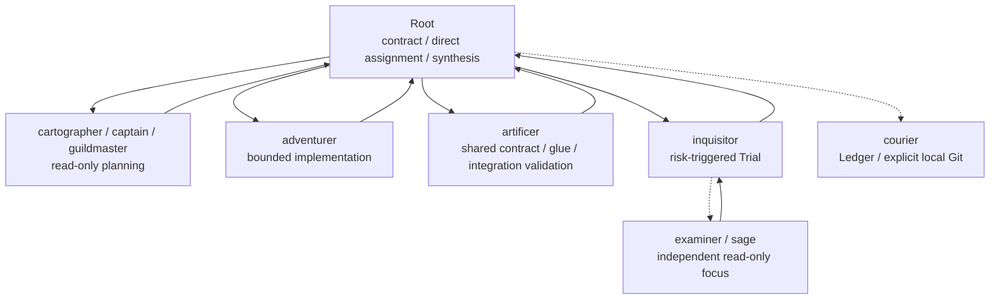

# Agent deployment

Codexはギルド規約rootで起動し、作業repoを `<guild_root>/repositories/<repo>` に置きます。Rootは`target_repo_root`を固定し、custom agentを直接起動します。

## Configuration

RootはSol/highを既定値にします。

```toml
model = "gpt-5.6-sol"
model_reasoning_effort = "high"
sandbox_mode = "read-only"
approval_policy = "on-request"

[sandbox_workspace_write]
network_access = true

[agents]
max_threads = 6
max_depth = 1
```

通常の再installでは、利用者が設定したRootの`high`、`xhigh`、`max`を保持します。許可外または未指定のeffortは既定`high`へ戻します。`max`は利用者が例外的に明示選択する場合だけ使い、installerやorchestrationは自動選択しません。clean installは既定`high`へ戻します。

`workspace-write` agentの外部通信は有効です。外部通信を伴うコマンドも`approval_policy = "on-request"`と実行環境の承認境界に従います。

全custom agentは`features.multi_agent=false`のterminal workerです。公式default相当のdepth/threadを使い、write-heavyな再帰委譲を防ぎます。

## Deployment role pairs

| agent | model | sandbox | reasoning | responsibility |
| --- | --- | --- | --- | --- |
| Root | `gpt-5.6-sol` | `read-only` | 既定`high`、許可`high/xhigh/max` | intake、境界、直接assignment、最終統合 |
| `adventurer` | `gpt-5.6-sol` | `workspace-write` | `high` | 一つのbounded scopeの実装と検証 |
| `artificer` | `gpt-5.6-sol` | `workspace-write` | `high` | 共有契約、cross-scope glue、統合検証 |
| `sage` | `gpt-5.6-sol` | `read-only` | `high` | 具体的な独立focusの助言 |
| `cartographer` | `gpt-5.6-sol` | `read-only` | `high` | read-only mapmaking |
| `courier` | `gpt-5.3-codex-spark` | `workspace-write` | `xhigh` | Ledgerと明示されたlocal Git操作 |
| `examiner` | `gpt-5.6-sol` | `read-only` | `high` | 単一focusのbounded review evidence |
| `guildmaster` | `gpt-5.6-sol` | `read-only` | `xhigh` | 複数Partyの広域戦略 |
| `inquisitor` | `gpt-5.6-sol` | `read-only` | `high` | Trial、finding統合、最終decision |
| `captain` | `gpt-5.6-sol` | `read-only` | `high` | scope、順序、integration、Trial設計 |
| `warden` | `gpt-5.6-sol` | `read-only` | `high` | 例外的な制御診断 |

現在の5.6 subagent deploymentは、live非劣性確認までSolを維持します。phase oneでは`adventurer`、`cartographer`、`examiner`、`warden`のTerra/highと、`sage`のLuna/highおよびTerra/highを同じhighで比較します。`artificer`と`captain`は今回の低コスト化対象外です。Courierは5.3-Spark/xhighを維持します。

subagentのreasoning effortはroleごとに固定し、実行中に動的変更しません。`guildmaster`は現行xhighとhigh、`inquisitor`は現行highとxhighをblind比較してから固定値を判断します。maxはroutine evalと全subagentから除外します。Rootだけは利用者がhigh以上から選択できます。

## Guild role naming

custom agentの機械IDは、責務を推測できる一語のGuild職へ統一します。

| retired ID | current ID | role boundary |
| --- | --- | --- |
| `party_leader` | `captain` | Partyのscope、順序、統合、Trial設計 |
| `integration_owner` | `artificer` | cross-scope契約、glue、統合検証 |
| `focus_reviewer` | `examiner` | Trialの単一focusに対する独立evidence |
| `advisor` | `sage` | owner判断を補う一論点のread-only助言 |
| `quest_sentinel` | `warden` | 通常制御で解消しない例外の診断 |

旧IDと新IDを同じruntimeで混在させません。通常installは旧agent fileを除去し、既存SQLite stateに旧worker ID、role、kindが残る場合はfail closedにします。必要なstateを保全したうえで`--backup --reset-runtime`または`--clean-install`を使ってください。

## Topology



`captain`や`inquisitor`はagentを直接起動せず、必要なassignment案をRootへ返します。これにより`max_depth=1`を維持しつつauthorityとownershipを一か所で検証できます。

## Integration

並列mutationでは次を必須にします。

1. 共通base snapshot
2. 重複しないowned scopeと共有artifactの単一owner
3. 各workerのowned-scope result
4. 全report後のmutation停止
5. `artificer`によるcross-scope glueと統合検証
6. integrated snapshotに対するTrial

`adventurer`へglobal integrationを兼務させません。

## Review roles

`sage`は具体的な独立focusがある時だけ使い、ownerがevidenceを確認します。`warden`は矛盾、反復失敗、scope drift、長時間停滞の例外時だけ使います。

`examiner.allowed_callers=[inquisitor]`はpolicy-onlyでありruntime ACLではありません。terminal設定とqueue lineage validatorを併用し、確認不能ならfail closedにします。複数reviewerを使う時だけfocus分割を記録し、最終decisionは`inquisitor`が行います。

## Install

```bash
./scripts/install.sh --target /path/to/guild-root --mode copy
```

メジャー更新や旧構成を確実に片付ける場合:

```bash
./scripts/clean_install.sh --target /path/to/guild-root
```

既存導入を差分更新する場合:

```bash
./scripts/sync.sh --target /path/to/guild-root
```

source template内のsymlink、secret-like path、MCPなどの外部tool連携pathは拒否します。既存Ledgerの物理schemaが互換でない場合は自動migrationせず、backup/resetまたはclean installを使います。

## Validation

```bash
make validate
python3 scripts/model_selection_eval.py validate
python3 scripts/model_selection_eval.py plan
```

validatorは次を確認します。

- Root Sol/high既定、high/xhigh/max override、maxの明示利用限定
- GuildmasterとInquisitorのSol high/xhigh比較、およびsubagent max禁止
- Courier Spark/xhighの維持
- 全custom agentのterminal設定
- `max_threads=6`、`max_depth=1`
- compact promptの行数と旧制約の不在
- target/secret/state-change/snapshot/lineageのfail-closed
- prompt profile、role topology、model/effortを分離した評価契約
- end-to-end final outcome hard gate

live model比較は外部送信許可とreview済みwrapper/profileがある場合だけ実行します。component scoreだけでproduction最適化を断定しません。
