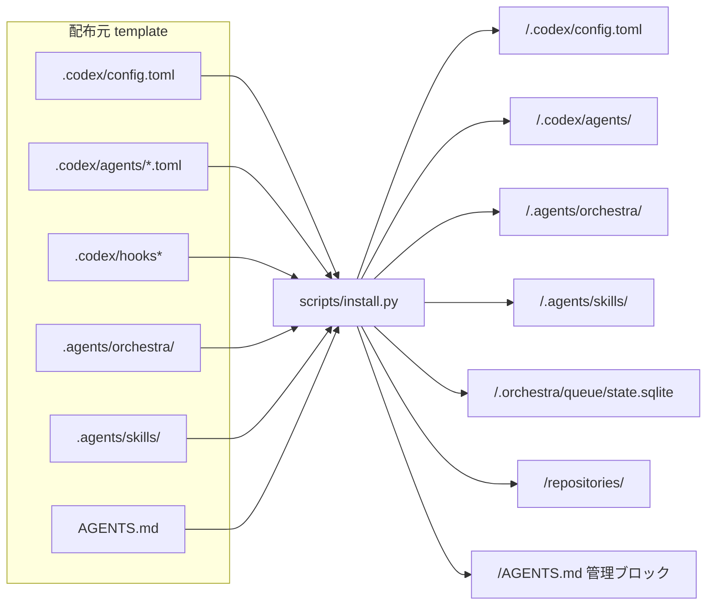
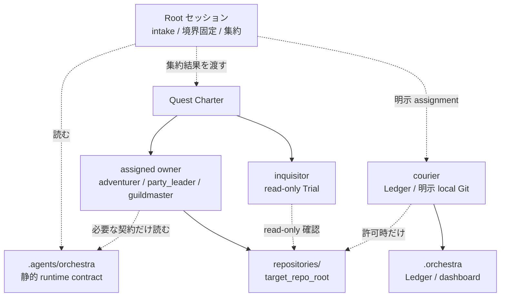
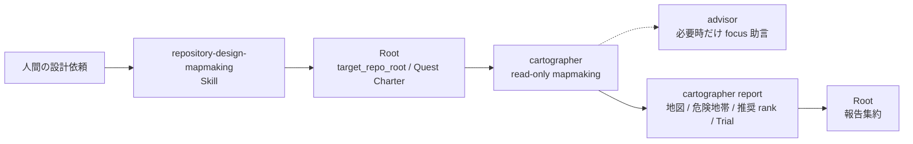
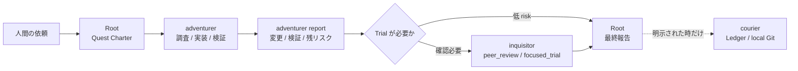
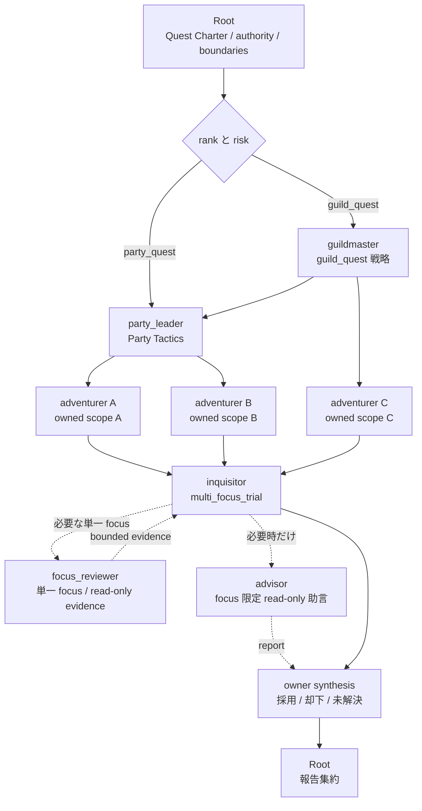
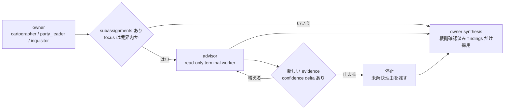
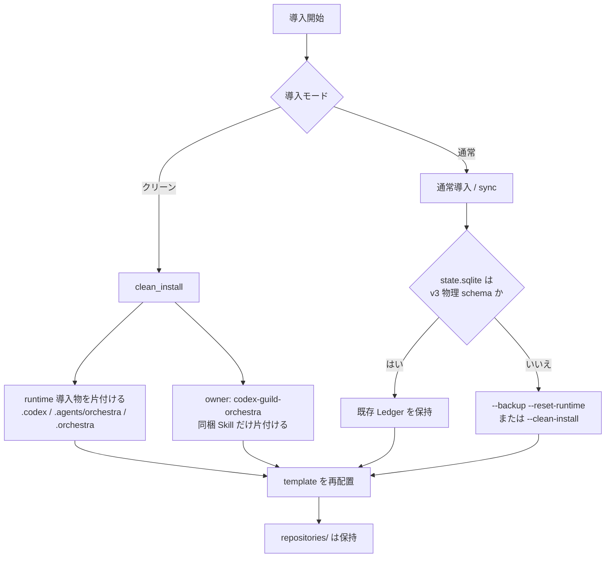

# エージェント展開

この文書は、`codex-guild-orchestra` のテンプレートをギルド規約ルートへ導入した時に、Codex の役割 agent、役割指示、Skill、Ledger 補助をどう配置するかをまとめます。
ここでの「展開」はローカル runtime の導入であり、外部サービスへのデプロイではありません。

## 正本

展開対象の正本は `template/` です。
導入済み環境を直接正本にせず、変更はこのリポジトリのテンプレートと検証を更新してから再導入します。

- `template/.codex/config.toml`: Root セッションと multi-agent 実行設定
- `template/.codex/agents/*.toml`: Codex subagent 定義
- `template/.codex/hooks.json` と `template/.codex/hooks/`: Stop hook
- `template/.agents/orchestra/config/settings.yaml`: Guild-native runtime contract
- `template/.agents/orchestra/instructions/*.md`: 役割別の永続指示
- `template/.agents/orchestra/queue/templates/*.yaml`: assignment / report / trial / inbox の雛形
- `template/.agents/orchestra/scripts/`: Ledger 操作用 helper、Claude 互換 context helper、schema
- `template/.agents/skills/*/SKILL.md`: codex-guild-orchestra 同梱 Skill
- `template/AGENTS.md`: ギルド規約ルートへ差し込む管理ブロック

`scripts/validation/fixtures/` は配布元リポジトリの検証データであり、導入先ギルド規約ルートへコピーしません。
golden Quest は runtime を評価するための静的 fixture で、runtime state や子リポジトリの一部ではありません。

## 展開先

導入先は子リポジトリではなく、必ずギルド規約ルートです。

```text
<guild_root>/
  AGENTS.md
  .codex/
    config.toml
    agents/
    hooks.json
    hooks/
  .agents/
    orchestra/
    skills/
  .orchestra/
    queue/state.sqlite
    dashboard.md
  repositories/
    <repo>/
```

`template/.agents/orchestra/dashboard.md` は導入時に `.orchestra/dashboard.md` へ配置されます。
子リポジトリへ `.agents`、`.codex`、`codex-guild-orchestra` 管理ブロックは再導入しません。
子リポジトリに既存の `CLAUDE.md` や `.claude/skills/**/SKILL.md` がある場合も、それらを `.agents/skills` へコピーせず、`claude_compat.py` helper が未信頼 context として読むだけです。

## 展開パターン

代表的な展開パターンを Mermaid で示します。
ここでは、ファイル配置としての展開と、Quest 実行時にどの agent が割り当てられるかを分けて見ます。

### 標準導入

`install.py` は `template/` を正本として、ギルド規約ルートへ runtime contract、agent 定義、Skill、動的状態の初期値を配置します。



### 対象 repo 作業

Codex はギルド規約ルートを開き、実作業は Root が固定した `target_repo_root` だけに限定します。
`.agents/orchestra` と `.orchestra` は runtime を読むための例外であり、対象 repo の再特定や scope 拡張には使いません。



### mapmaking

設計、実装計画、方針整理、アーキテクチャ検討だけを求められた時は、`repository-design-mapmaking` Skill を入口にして、Root が read-only の `cartographer` へ mapmaking assignment を渡します。
Root は対象確認と報告集約だけを担当し、設計調査や採否を直接代替しません。



### solo_quest

単独担当で完結できる作業では、`adventurer` が調査、実装、検証を行い、risk に応じて `inquisitor` が Trial を行います。
Ledger 反映や local Git は、Root が明示した場合だけ `courier` に渡します。



### party_quest / guild_quest

分担や広い判断が必要な時は、`party_leader` または `guildmaster` が Party Tactics を設計し、owned scope ごとに `adventurer` を割り当てます。
Trial は `inquisitor` が統合し、architecture / safety / regression / validation などの high-value focus では `advisor` 利用を既定で検討します。



### advisor dialogue

`advisor` は実装分業者ではなく、owner confidence を上げるための focus 限定助言担当です。
同じ focus で新しい evidence が増える間だけ dialogue を続け、進捗が止まる場合は停止理由を返します。



### クリーンインストールと状態保持

通常更新では v3 schema と旧値なしを満たす `state.sqlite` だけを保持します。
旧 schema や旧 worker 値が残る場合は、状態を保全して初期化するか、クリーンインストールで導入物を入れ替えます。



## 現在の agent

`.codex/agents` に展開される Codex subagent は次の 9 つです。
`receptionist` は Quest Charter を作る契約上の役割ですが、現時点では単独の `.codex/agents/receptionist.toml` は置かず、Root の intake として扱います。

| agent | ファイル | model | sandbox | reasoning | 主な責務 |
| --- | --- | --- | --- | --- | --- |
| `adventurer` | `.codex/agents/adventurer.toml` | `gpt-5.6-terra` | `workspace-write` | `high` | Quest Charter の範囲内で調査、実装、検証を自律遂行する |
| `advisor` | `.codex/agents/advisor.toml` | `gpt-5.6-luna` | `read-only` | `high` | focus 限定の読み取り助言を返す terminal worker |
| `cartographer` | `.codex/agents/cartographer.toml` | `gpt-5.6-terra` | `read-only` | `high` | 設計、実装計画、方針整理、アーキテクチャ検討を `mapmaking` として扱い、地図、危険地帯、推奨 rank、Trial 方針を整理する |
| `courier` | `.codex/agents/courier.toml` | `gpt-5.3-codex-spark` | `workspace-write` | `xhigh` | Ledger 反映と Root が明示した local Git 操作だけを扱う |
| `focus_reviewer` | `.codex/agents/focus_reviewer.toml` | `gpt-5.6-terra` | `read-only` | `high` | `inquisitor` から割り当てられた単一 focus の bounded evidence だけを返す terminal worker |
| `guildmaster` | `.codex/agents/guildmaster.toml` | `gpt-5.6-sol` | `read-only` | `xhigh` | `guild_quest` の戦略、Party 境界、authority、Trial 方針を設計する |
| `inquisitor` | `.codex/agents/inquisitor.toml` | `gpt-5.6-sol` | `read-only` | `high` | Trial lead / integrator としてreviewer evidence、重大度、finding disposition、最終decisionを統合する |
| `quest_sentinel` | `.codex/agents/quest_sentinel.toml` | `gpt-5.6-luna` | `read-only` | `high` | quest_awareness、confidence、unknowns、verification status を監視し、次アクションだけを推薦する |
| `party_leader` | `.codex/agents/party_leader.toml` | `gpt-5.6-sol` | `read-only` | `high` | Party Tactics、割り当て、Trial depth を設計する |

Root の既定設定は `template/.codex/config.toml` で管理します。
現在は Root の model を `gpt-5.6-sol`、sandbox を `read-only`、approval を `on-request`、workspace-write 時の network を無効、web search を `cached` とし、`agents.max_threads = 12`、`agents.max_depth = 4`、`job_max_runtime_seconds = 1200` を設定します。
Root の reasoning effort は `high` に固定します。全 subagent も role ごとの固定値を持ち、Quest の難度に応じた動的な effort 切り替えは行いません。
`model_context_window` も固定せず、5.6 系と `gpt-5.3-codex-spark` それぞれの model catalog 値を使います。

モデルは責務の失敗コストと並列頻度から固定します。意図と境界を全体へ伝播する Root、複数 worker の assignment を設計する `party_leader`、guild strategy、最終採否を扱う `guildmaster` / `inquisitor` には frontier model の `gpt-5.6-sol` を使います。read-heavy な mapmaking、上流で scope を限定された実装、単一 focus に限定され最終 decision を持たない `focus_reviewer` には balanced model の `gpt-5.6-terra` を使います。owner が根拠を再確認する focus 限定助言と、狭い構造化制御には高速な `gpt-5.6-luna` を使います。

固定 effort は、通常の複雑な判断、edge case、検証を扱う role を `high`、guild-scale の境界、sequencing、safety gate に限定される `guildmaster` を `xhigh` とします。`max` は現行candidate matrixに含めますが、blind反復評価で`xhigh`への品質向上を確認するまでは固定採用しません。`ultra` は自動委譲が明示 assignment と terminal worker 契約に干渉し得るため採用しません。評価条件、隣接候補、legacy smokeと現在の評価状態は [GPT-5.6 role model selection](model-selection-evaluation.md) に記録します。

## workers 設定

`settings.yaml` の `workers` は runtime contract 側の並列性と役割境界です。
Codex subagent 定義と完全に同じ粒度ではなく、実行時の割り当て判断に使います。

| worker | max_parallel | 補足 |
| --- | ---: | --- |
| `party_leader` | 2 | Party Tactics と assignment 境界を設計する |
| `adventurer` | 5 | 実装担当として同時に複数 scope を扱える |
| `inquisitor` | 3 | 独立したQuestのTrial lead / integratorとして最終decisionを統合する |
| `focus_reviewer` | 3 | `inquisitor`から割り当てられた単一focusのbounded read-only evidenceだけを返す |
| `advisor` | 4 | focus 限定の read-only 助言だけを返す |
| `quest_sentinel` | 2 | confidence、unknowns、verification status の制御判断だけを返す |

`advisor` は terminal worker です。
実装、採否、Ledger 反映、追加 subagent 起動は行わず、owner が根拠確認した findings だけを synthesis に採用します。
`quest_sentinel` も read-only の terminal worker で、実装や採否ではなく `control_decision` の推薦だけを返します。
`focus_reviewer.allowed_callers = [inquisitor]` は現行Codex custom agentにactual parent identityのruntime ACLがないためpolicy-onlyです。`features.multi_agent = false`で再委任を実効的に無効化し、起動時はqueueの`trial_ref`、trial owner、assignment lineageも照合しますが、caller rule自体をsandbox security boundaryとは主張しません。

focus reviewer 数は固定しません。
軽微で局所的な変更は追加 reviewer 0..1、`multi_focus_trial` や安全境界、検証不足、広い blast radius がある変更は `autonomy_budget.subassignments` と `workers.focus_reviewer.max_parallel` の小さい方を上限に分割します。
複数 reviewer を使う時は、例として `contract consistency`、`deployment safety`、`validation coverage` のように focus を分け、cost reason と finding disposition を Trial evidence に残します。

## 導入手順

標準導入は `install.sh` を使います。

```bash
./scripts/install.sh --target /path/to/guild-root --mode copy
```

メジャー更新や旧構成を確実に片付ける時はクリーンインストールを使います。

```bash
./scripts/clean_install.sh --target /path/to/guild-root
```

既存導入を保持しながら差分更新したい運用だけ、`sync.sh` を使います。

```bash
./scripts/sync.sh --target /path/to/guild-root
```

Codex 上で `.agents/` や `.codex/` の protected path に書く必要がある場合は、実行前に人間確認を取ります。
通常の端末で実行する場合も、導入先は `/`、`$HOME`、`repositories/` 配下ではなく、専用のギルド規約ルートにします。
既定以外の `--source` を使う検証では、信頼済み template であることを確認したうえで `--allow-non-default-source` を明示します。
source template 内の symlink、秘密情報らしい path、MCP などの外部 tool 連携 path は拒否します。

## install.py の処理

`scripts/install.py` は次を実行します。

- `template/` のファイルをギルド規約ルートへコピーする
- `template/.agents/orchestra/dashboard.md` を `.orchestra/dashboard.md` へ写す
- `AGENTS.md` の `codex-guild-orchestra` 管理ブロックだけを追加または更新する
- `repositories/` を作成する
- `.orchestra/queue/state.sqlite` を v3 schema で初期化する
- 既存 `state.sqlite` が v3 物理 schema と旧値なしを満たす時だけ保持する
- Git ルートでは `.git/info/exclude` に runtime 配置を追加する
- 削除済みテンプレートファイルを導入先から片付ける

既定の Git 除外対象は `.agents/orchestra/`、`.codex/`、`.orchestra/`、`.codex-guild-orchestra-backups/` です。
`.agents/skills/` は共有対象にできるため、既定では除外しません。

## 同梱 Skill

`template/.agents/skills/` は `owner: codex-guild-orchestra` を持つ Skill を展開します。
対象 repo 作業向けの Skill は `scope: target-repository-workflow`、オーケストレーション本体向けの Skill は `scope: orchestration-template-workflow` です。
対象 repo の `.claude/skills/**/SKILL.md` は Codex native Skill として導入せず、Claude 互換 context card としてのみ扱います。
設計、実装計画、方針整理、アーキテクチャ検討などの実装前相談は `repository-design-mapmaking` が受け、Root が read-only `cartographer` へ mapmaking assignment を渡します。

クリーンインストールでは、導入先の `.agents/skills/` のうち `owner: codex-guild-orchestra` の Skill だけを片付けてから再配置します。
他の owner の Skill は削除対象にしません。

## 旧構成の扱い

現行 runtime は Guild-native contract を正本にします。
旧い規模依存の経路、旧 worker、旧 `task` 雛形は戻しません。

導入時に片付ける削除済みテンプレートは次です。

- `.codex/agents/spark.toml`
- 旧 control-monitoring agent 定義
- `.agents/orchestra/queue/templates/adventurer_task.yaml`
- `.agents/orchestra/queue/templates/inquisitor_task.yaml`
- 旧 task-loop Skill ディレクトリ

既存 Ledger に旧 schema、旧 Rank、旧 worker 値、旧 JSON key が残る場合、通常更新では保持しません。
状態を保全して初期化する時は `--backup --reset-runtime`、導入物全体を入れ替える時は `--clean-install` を使います。

## 検証

テンプレート更新後は次を実行します。

```bash
make validate
```

model / effort のcandidate matrixとsynthetic fixtureだけを確認する場合は、外部 model を呼ばないmanifest validationを実行します。

```bash
python3 scripts/model_selection_eval.py validate
python3 scripts/model_selection_eval.py plan
```

live比較はrole指示とsynthetic fixtureを外部 model serviceへ送るため、data policyと明示許可を確認してから`run` subcommandを使います。結果は既定でrepository外の`/tmp/codex-guild-model-eval`へ保存します。

導入挙動だけを確認する時は dry-run を使います。

```bash
tmp="$(mktemp -d)"
./scripts/install.sh --target "$tmp" --mode copy --dry-run
rm -rf "$tmp"
```

最低限確認する観点は次です。

- `docs/agent-deployment.md` が存在し、現行 agent 一覧と一致している
- `.codex/agents` に旧 worker 定義が戻っていない
- Root が `gpt-5.6-sol`、`model_reasoning_effort = "high"` に固定されている
- `advisor` が `read-only`、`model_reasoning_effort = "high"`、terminal worker 契約を持つ
- `focus_reviewer` が `gpt-5.6-terra` / `high`、read-only、単一 focus、decision authorityなしの契約を持つ
- `agents.max_depth = 4` を維持している
- `settings.yaml` の worker 並列数と advisory consultation が壊れていない
- v3 Ledger schema の必要 table / column を維持している
- 子リポジトリへ runtime を再導入する説明になっていない
